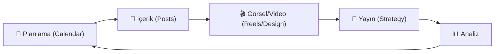

# 📱 code_with_yunus | Instagram Content Center

  
  
  

---

## 🛰️ **Operasyonel Merkez**

> [!TIP]
> **Stratejik Vizyon:** Bu projenin ruhunu anlamak için [Manifesto](./_MANIFESTO.md) dosyasını inceleyin. Operasyonel mükemmellik için [Stratejik Protokol](./STRATEGIC_PROTOCOL.md) kılavuzunu takip edin.

Bu depo, `code_with_yunus` Instagram markasının dijital omurgasını oluşturur. Tüm içerik üretim süreçleri, stratejik planlamalar ve teknik dokümantasyon burada merkezi bir şekilde yönetilir.

### 🏗️ **İçerik Üretim Hattı**

---

## 📂 **Merkezi Arşiv**

| Kategori | Açıklama | Bağlantı |
| :--- | :--- | :--- |
| **🎯 Postlar** | Detaylı post rehberleri ve hashtag stratejileri | [Görüntüle](./posts/) |
| **🎬 Reels** | Yüksek etkileşimli video senaryoları | [Görüntüle](./reels/) |
| **📅 Takvim** | 30 günlük içerik projeksiyonu | [Görüntüle](./calendar/) |
| **🎓 Eğitim** | Yazılım dersleri ve teknik doktrinler | [Görüntüle](./education/) |
| **📊 Strateji** | Algoritma optimizasyonu ve büyüme taktikleri | [Görüntüle](./strategy/) |
| **🎨 Tasarım** | Marka kimliği ve görsel varlıklar | [Görüntüle](./design/) |
| **📝 Araçlar** | AI destekli üretim ve analiz araçları | [Görüntüle](./tools/) |
| **📋 Şablonlar** | [NEW] Standart üretim blueprintleri | [Görüntüle](./_TEMPLATES/) |

---

## 📈 **Stratejik Hedefler**

> [!IMPORTANT]
> Marka kimliğini korumak için içerik üretiminde aşağıdaki hedeflere sadık kalınmaktadır.

- **Frekans:** Günlük `1 Post` + `1 Reel` disiplini.
- **Kalite:** Her içerikte en az bir "Kaydetmeye Değer" teknik bilgi.
- **Etkileşim:** Hedef %5+ etkileşim oranı ve topluluk yönetimi.
- **Büyüme:** Organik ve stratejik takipçi kazanımı (Hedef: 1000+).

---

## 🔄 **Sistem Güncellemeleri**

- **Son Senkronizasyon:** Aralık 2024
- **Aktif Faz:** 2025 Yılı Stratejik Planlaması
- **Yeni Odak:** AI Entegrasyonu ve Verimlilik Araçları

---

  Built for <b>code_with_yunus</b> by <b>Antigravity AI</b>

