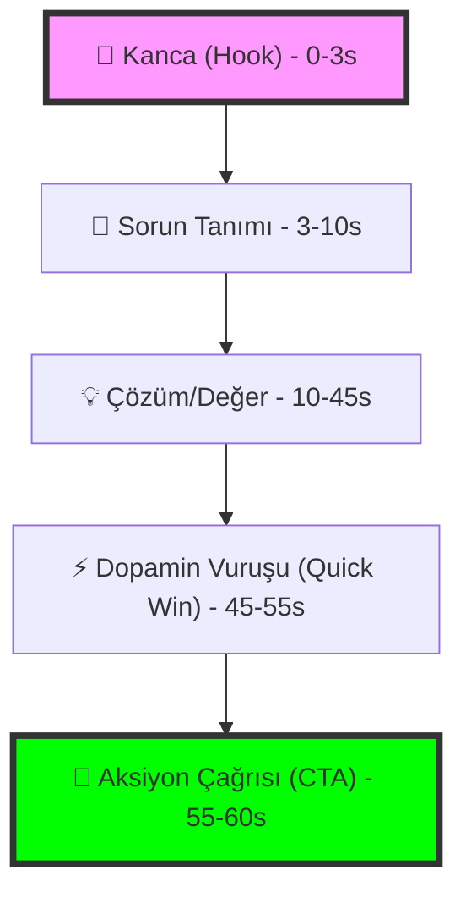

# 🎬 Reels Senaryoları ve Storyboard'ları

> Instagram Reels için detaylı senaryolar, çekim açıları ve teknik detaylar

## 🎯 **Reel Kategorileri**

### 🚀 [Başlangıç Seviyesi](./baslangic/)
- İlk kod yazma deneyimleri
- Programlama temelleri
- Motivasyon reels
- Başlangıç ipuçları

### 💻 [Teknik İçerikler](./teknik/)
- Kod örnekleri
- Debugging süreçleri
- Tool tanıtımları
- Best practices

### 🎓 [Eğitim Reels](./egitim/)
- Adım adım öğreticiler
- Kısa dersler
- Quiz reels
- Ödev çözümleri

### 🚨 [Hata Çözümleri](./hata-cozumleri/)
- Yaygın hatalar
- Debugging ipuçları
- Troubleshooting
- Error prevention

### 🎨 [Proje Showcase](./proje-showcase/)
- Proje demoları
- Code walkthrough
- Feature highlights
- Portfolio reels

### 💡 [İpuçları ve Tricks](./ipuculari/)
- Kısayollar
- Verimlilik artırma
- Gizli özellikler
- Pro tips

### 🌟 [Başarı Hikayeleri](./basari-hikayeleri/)
- Öğrenci başarıları
- Kariyer gelişimi
- Motivasyon hikayeleri
- İlham verici içerikler

### 🔥 [Trend Konular](./trend-konular/)
- Güncel teknolojiler
- Yeni özellikler
- Framework güncellemeleri
- AI/ML trendleri

### 🎭 [Eğlenceli İçerikler](./eglenceli/)
- Programcı mizahı
- Meme reels
- Funny bugs
- Stack Overflow aramaları

## 📱 **Reel Formatları**

### ⏱️ **Kısa Format (15-30 saniye)**
- Hızlı ipuçları
- Kod parçacıkları
- Hızlı düzeltmeler
- Kısa açıklamalar

### 🎬 **Orta Format (30-60 saniye)**
- Adım adım rehberler
- Tool tanıtımları
- Hata çözümleri
- Proje özellikleri

### 📹 **Uzun Format (60+ saniye)**
- Detaylı öğreticiler
- Proje demoları
- Code review
- Interview style

## 🎨 **Görsel Stil Rehberi**

### 🎨 **Renk Paleti**
- **Ana Renkler:** Mavi (#2563EB), Yeşil (#10B981), Siyah (#111827)
- **Vurgu Renkleri:** Turuncu (#F59E0B), Mor (#8B5CF6), Kırmızı (#EF4444)
- **Nötr Renkler:** Gri (#6B7280), Beyaz (#FFFFFF), Açık Gri (#F3F4F6)

### 🔤 **Typography**
- **Başlık Fontları:** Inter, Roboto, SF Pro Display
- **Kod Fontları:** Fira Code, JetBrains Mono, Source Code Pro
- **Font Boyutları:** Başlık 24-32px, Alt başlık 18-24px, Metin 14-16px

### 🎭 **Görsel Elementler**
- **Arka Plan:** Gradient, Solid color, Code editor
- **Overlay:** Semi-transparent shapes, Blur effects
- **Animasyonlar:** Smooth transitions, Hover effects, Loading states

## 📹 **Çekim Teknikleri**

### 📱 **Mobil Çekim**
- **Açı:** 90° dikey (Instagram Reels için optimize)
- **Stabilizasyon:** Tripod veya stabilizer kullan
- **Işık:** Doğal ışık veya soft LED
- **Çözünürlük:** 1080x1920px minimum

### 💻 **Screen Recording**
- **Yazılım:** OBS Studio, Loom, ScreenFlow
- **Çözünürlük:** 1080p minimum
- **FPS:** 30fps (smooth playback için)
- **Audio:** High quality microphone

### 🎬 **Video Editing**
- **Yazılım:** CapCut, InShot, Adobe Premiere
- **Transitions:** Smooth cuts, Fade effects
- **Text Overlays:** Animated captions
- **Background Music:** Royalty-free tracks

## 🎵 **Ses ve Müzik**

### 🎵 **Müzik Kategorileri**
- **Upbeat:** Motivasyon, başarı hikayeleri
- **Calm:** Eğitim, tutorial
- **Tech:** Teknik içerikler
- **Funny:** Eğlenceli içerikler

### 🎤 **Ses Kalitesi**
- **Microphone:** USB condenser mic
- **Noise Reduction:** Background noise filtering
- **Audio Levels:** -12dB to -6dB range
- **Voice Clarity:** Clear pronunciation

## 📋 **Reel Senaryo Formatı**

### 🎬 **Storyboard Template**
```markdown
## 📱 [Reel Başlığı]

### 🎯 **Hedef**
- Ana mesaj
- Hedef kitle
- Beklenen sonuç

### ⏱️ **Süre**
- Toplam süre: XX saniye
- Her bölüm süresi

### 📹 **Sahne Detayları**

#### Sahne 1 (0-5s)
- **Görsel:** Hook/başlık
- **Ses:** Müzik başlangıcı
- **Metin:** Ana başlık

#### Sahne 2 (5-15s)
- **Görsel:** Ana içerik
- **Ses:** Açıklama
- **Metin:** Alt başlık

#### Sahne 3 (15-25s)
- **Görsel:** Demo/örnek
- **Ses:** Detaylar
- **Metin:** Açıklama

#### Sahne 4 (25-30s)
- **Görsel:** Call-to-action
- **Ses:** Kapanış
- **Metin:** CTA metni

### 🏷️ **Hashtag'ler**
- Ana hashtag'ler
- Niche hashtag'ler
- Trend hashtag'ler

### 📱 **Caption Önerisi**
- Kısa açıklama
- Call-to-action
- Link (bio'da)
```

## 🎯 **İçerik Stratejisi**

### 📅 **Haftalık Plan**
- **Pazartesi:** Motivasyon reel
- **Salı:** Teknik içerik
- **Çarşamba:** Eğitim reel
- **Perşembe:** Hata çözümü
- **Cuma:** Proje showcase
- **Hafta sonu:** Eğlenceli içerik

### 📚 **Aylık Hedefler**
- 30 reel üretimi
- 5 farklı kategori
- 3 viral potansiyeli
- 1 trend reel

## 📊 **Performance Metrikleri**

### 📈 **Engagement**
- **View Rate:** %80+ hedef
- **Like Rate:** %5+ hedef
- **Comment Rate:** %2+ hedef
- **Share Rate:** %1+ hedef

### 🎯 **Reach**
- **Follower Reach:** %90+ hedef
- **Hashtag Reach:** %10+ hedef
- **Explore Reach:** %5+ hedef
- **Viral Potential:** %1+ hedef

## 🔗 **Trend ve Hashtag Stratejisi**

### 🔥 **Popüler Hashtag'ler**
- #coding #programming #developer
- #reels #instagram #viral
- #codingreels #programmingreels
- #techreels #codinglife

### 🎯 **Niche Hashtag'ler**
- #codingbeginner #learntocode
- #codingbootcamp #selfstudy
- #codingcommunity #devcommunity
- #codingtips #programmingtips

### 📍 **Lokal Hashtag'ler**
- #türkiyede #istanbul #ankara
- #türkyazılımcı #türkdeveloper
- #türkiyeprogramlama #türkcoding

## 🚀 **Viral Reel Teknikleri**

### 🏗️ **Viral Mimari (Viral Architecture)**



### ⚡ **Hook Stratejileri**
- **Negative Hook:** "Bunu yapmayı hemen bırak!" (Merak uyandırır).
- **Transformation Hook:** "X'ten Y'ye nasıl geldim?" (İlham verir).
- **Logic Hook:** "Neden X kullanmalısın?" (Otorite kurar).
- **Speed Hook:** "5 saniyede X yapmak." (Verimlilik odaklı).

### 📱 **Retention (Elde Tutma) Teknikleri**
- **Pattern Interrupt:** Görseli veya sesi aniden değiştirerek beyni meşgul tut.
- **Subtitles:** Her kelimeyi değil, sadece anahtar kelimeleri vurgula.
- **Looping:** Videonun başı ve sonunu öyle bir birleştir ki izleyici bittiğini anlamasın.

### 🔄 **Shareability (Paylaşılabilirlik)**
- **Saveable Value:** "Bunu sonra kullanmak için kaydet" (Arşivlik bilgi).
- **Relatable Humour:** "Yazılımcıların %99'u bunu yaşıyor" (Topluluk aidiyeti).
- **Expert Insight:** Başka yerde bulunmayan bir teknik detay.

## 📋 **Reel Kontrol Listesi**

### ✅ **Pre-Production**
- [ ] Senaryo yazıldı
- [ ] Storyboard hazırlandı
- [ ] Gerekli araçlar hazır
- [ ] Müzik seçildi
- [ ] Hashtag'ler belirlendi

### ✅ **Production**
- [ ] Çekim tamamlandı
- [ ] Ses kalitesi kontrol
- [ ] Görsel kalitesi kontrol
- [ ] Süre hedefi tutturuldu

### ✅ **Post-Production**
- [ ] Video editlendi
- [ ] Text overlay'ler eklendi
- [ ] Müzik sync edildi
- [ ] Caption yazıldı
- [ ] Hashtag'ler eklendi

### ✅ **Publishing**
- [ ] Zaman planlandı
- [ ] Caption optimize edildi
- [ ] Hashtag'ler eklendi
- [ ] Call-to-action eklendi
- [ ] Engagement için hazır

> 💡 **İpucu:** Her reel'de bir ana mesaj verin ve görsel olarak çekici hale getirin!
